<!-- HERO:START -->

  

<!-- HERO:END -->

  <a href="https://github.com/pockebot/openpocket"><strong>OpenPocket</strong></a>
  &nbsp;/&nbsp;
  <a href="https://github.com/t54-labs"><strong>t54-labs</strong></a>
  &nbsp;/&nbsp;
  <a href="https://github.com/pulls?q=is%3Apr+author%3ASergioChan"><strong>public PR trail</strong></a>

## Operating Thesis

I build end-to-end systems across AI-native products, developer tooling, agentic finance, payments, games, hardware, embedded systems, and VR/AR. The through-line is simple: ship the weird useful thing, prove it in public, then make it sharper.

## Current Focus

- Building [`OpenPocket`](https://github.com/pockebot/openpocket), a phone-use agent that treats the device as the runtime.
- Founder of [`t54-labs`](https://github.com/t54-labs), building payment and trust infrastructure for the agentic economy.
- Previous founder of [`rct-ai`](https://github.com/rct-ai).
- Hackathon roots with [`hACKbUSTER`](https://github.com/hACKbUSTER), where shipping under pressure became the default setting.

## Build Lab

<!-- BUILDING:START -->
- [`t54-labs/clawcredit-blockrun-gateway`](https://github.com/t54-labs/clawcredit-blockrun-gateway): Gateway layer for ClawCredit and BlockRun payment flows (TypeScript)
- [`t54-labs/x402-xrpl`](https://github.com/t54-labs/x402-xrpl): The AI Hub for XRPL developers (TypeScript)
- [`t54-labs/x402-secure`](https://github.com/t54-labs/x402-secure): Risk layer for the x402 protocol (Python)
- [`t54-labs/tpay-sdk-python`](https://github.com/t54-labs/tpay-sdk-python): Comprehensive AI payment solution for real-world applications (Python)
<!-- BUILDING:END -->

## Public PR Trail

<!-- CONTRIBUTING:START -->
- [`t54-labs/x402-xrpl`](https://github.com/t54-labs/x402-xrpl): Recent PR: `Fix: retire stale-owner rows when a merchant rotates its payTo (#18)` (merged)
- [`pockebot/openpocket`](https://github.com/pockebot/openpocket): Recent PR: `Add native Codex and Claude Code phone-use plugins` (merged)
<!-- CONTRIBUTING:END -->

## Open Source Footprint

<!-- OSS_SIGNAL:START -->
<table>
  <tr>
    <td width="210">
      <strong>Current-month code</strong> 
      July 2026: 297K all-file lines added, merge commits included.
    </td>
    <td width="210">
      <strong>Public footprint</strong> 
      297 public repos, 2.6K stars earned, 1.1K followers.
    </td>
    <td width="210">
      <strong>Contribution spread</strong> 
      150 public repositories touched via pull requests, 384 public PRs opened in total.
    </td>
    <td width="210">
      <strong>Recent pace</strong> 
      44 public PRs opened and 43 merged in the last 30 days.
    </td>
  </tr>
</table>
<!-- OSS_SIGNAL:END -->

  

  
<strong>Toolchain surface</strong>

   
  

    
    
    
    
    
    
    
    
  

